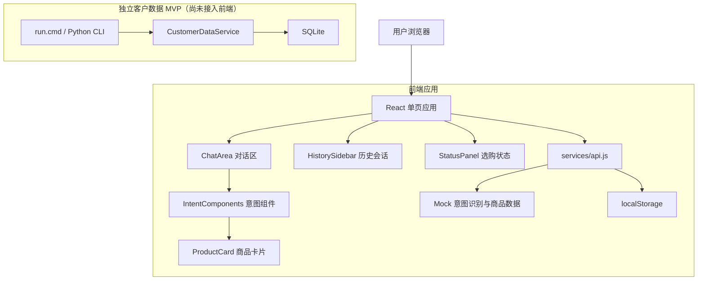
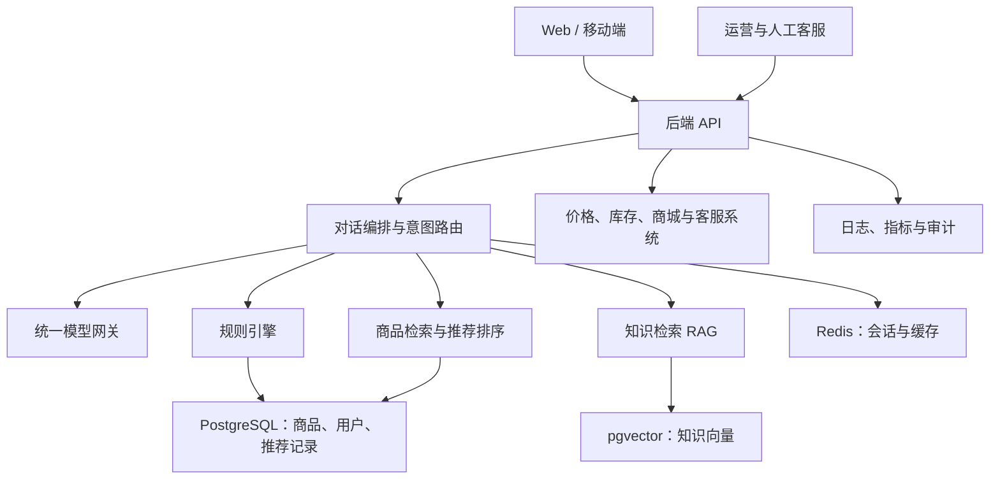
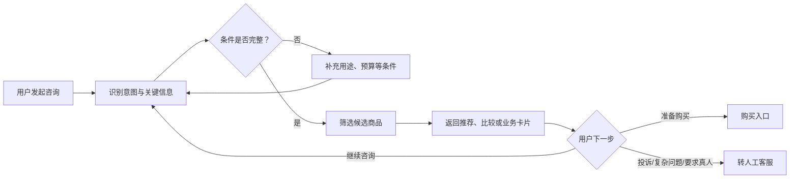

# 销冠 AI 鼠标销售智能体

面向鼠标及电脑外设销售场景的中文 AI 导购原型。项目提供赛博朋克“雷龙”主题网页、多意图销售对话、商品推荐与比较、询价及售后引导，并包含一个独立的本地客户会话与长期记忆数据库 MVP。

> 项目状态：可运行的前端演示版。当前 AI 回复和商品数据由前端 Mock 服务生成；`XGshujuku` 已实现 SQLite 数据服务，但尚未接入网页。真实大模型、商品/库存接口、后端 API 和生产数据库仍待集成。

## 目录

- [项目概览](#项目概览)
- [已实现功能](#已实现功能)
- [系统架构](#系统架构)
- [业务流程](#业务流程)
- [技术栈](#技术栈)
- [项目结构](#项目结构)
- [快速开始](#快速开始)
- [常用命令](#常用命令)
- [客户数据模块](#客户数据模块)
- [数据与隐私规则](#数据与隐私规则)
- [前后端集成说明](#前后端集成说明)
- [后续规划](#后续规划)
- [开发与测试约定](#开发与测试约定)
- [贡献指南](#贡献指南)
- [许可证](#许可证)

## 项目概览

销冠 AI 鼠标销售智能体用于验证“对话式导购 + 商品推荐 + 销售转化”的产品形态。用户可以通过自然语言表达用途、预算、设备和购买诉求，系统根据意图返回对应的交互组件，而不是只展示普通文本消息。

当前仓库包含两个可独立运行的部分：

1. **React 前端演示应用**：提供对话界面、意图卡片、商品推荐、会话历史和选购状态管理。
2. **Python 客户数据模块**：提供会话事实、授权后的长期记忆、推荐/报价记录、隐私删除和清理能力。

## 已实现功能

### 智能导购界面

- 中文多轮对话和加载状态展示。
- 办公、游戏、设计、便携等场景选择。
- `150 元内`、`150～400 元`、`400 元以上`预算筛选。
- 入门、进阶、旗舰商品卡片展示。
- 商品参数、价格、库存、物流和兼容性信息展示。
- 商品比较、议价提示、购买推进和企业采购入口。
- 售后、投诉及直接转人工引导。
- 当前筛选条件与候选商品状态面板。
- 响应式布局和雷龙赛博朋克视觉主题。

### 当前支持的对话意图

| 意图 | 标识 | 当前行为 |
| --- | --- | --- |
| 选购咨询 | `selection_consultation` | 引导用户选择用途和预算 |
| 商品推荐 | `product_recommendation` | 按场景从 Mock SKU 中返回商品 |
| 商品比较 | `product_comparison` | 展示两款商品的对比结果 |
| 参数咨询 | `parameter_query` | 回答 DPI、微动等基础问题 |
| 兼容性确认 | `compatibility_check` | 展示设备与商品兼容结果 |
| 价格咨询 | `price_inquiry` | 展示商品价格信息 |
| 议价/优惠 | `bargain` | 提供优惠说明或人工申请入口 |
| 库存物流 | `stock_logistics` | 展示模拟库存、仓库和时效 |
| 企业采购 | `enterprise_purchase` | 引导联系企业采购顾问 |
| 成交推进 | `purchase_push` | 展示购买与人工咨询入口 |
| 订单售后 | `after_sales` | 引导进入售后处理 |
| 投诉处理 | `complaint` | 停止销售推进并引导人工处理 |
| 直接转人工 | `direct_human` | 展示电话和在线客服入口 |

### 会话与客户记忆

- 浏览器端使用 `localStorage` 保存最近 50 条会话。
- 当前会话保存消息、筛选条件和候选商品。
- SQLite 模块默认保留匿名会话 7 天。
- 用户明确授权后才能写入长期记忆。
- 支持会话事实、摘要、推荐、报价、反馈和知识来源版本记录。
- 支持撤回授权、删除请求、定时清理和脱敏审计。
- 拦截身份证、银行卡、密码等敏感信息写入。

## 系统架构

### 当前实现



### 目标架构

后续生产化建议采用“模型负责理解与表达、数据库提供事实、规则引擎保证确定性”的分层架构：



生产系统中，价格、库存、优惠、保修和兼容性不得由大模型凭空生成，必须来自结构化数据、确定性规则或人工确认。

## 业务流程



当前版本通过关键词匹配模拟意图识别，并根据场景与预算过滤 Mock 商品。接入真实后端后，应将硬性筛选、报价、折扣权限和兼容性校验迁移至可测试的规则层。

## 技术栈

### 前端

| 技术 | 用途 |
| --- | --- |
| React 19 | 组件和状态管理 |
| Vite 8 | 本地开发与生产构建 |
| Tailwind CSS 3 | 响应式布局与主题样式 |
| Lucide React | 界面图标 |
| Oxlint | JavaScript/React 静态检查 |

### 客户数据模块

| 技术 | 用途 |
| --- | --- |
| Python 3.10+ | 数据服务和命令行工具 |
| SQLite | 单机客户会话与记忆存储 |
| `unittest` | 服务层自动化测试 |

Python 模块只使用标准库，无需安装第三方依赖。

## 项目结构

```text
.
├── public/                         # 公共静态资源
├── src/
│   ├── assets/                     # 品牌图和页面图片
│   ├── components/
│   │   ├── ChatArea.jsx            # 对话主区域
│   │   ├── Header.jsx              # 顶部导航
│   │   ├── HistorySidebar.jsx      # 历史会话侧栏
│   │   ├── IntentComponents.jsx    # 各类意图交互组件
│   │   ├── ProductCard.jsx         # 商品卡片
│   │   └── StatusPanel.jsx         # 条件与候选状态面板
│   ├── data/mockData.js            # Mock SKU、FAQ 和话术
│   ├── services/api.js             # Mock API 与本地会话服务
│   ├── App.jsx                     # 应用状态和事件编排
│   ├── index.css                   # Tailwind 与主题样式
│   └── main.jsx                    # 前端入口
├── XGshujuku/
│   ├── tests/test_service.py       # 客户数据服务测试
│   ├── xg_database/
│   │   ├── cli.py                  # 命令行入口
│   │   ├── schema.sql              # SQLite 数据结构
│   │   └── service.py              # 会话、记忆和隐私服务
│   ├── pyproject.toml
│   ├── README.md                   # 数据模块详细说明
│   └── run.cmd                     # Windows 快捷命令
├── package.json
├── tailwind.config.js
├── vite.config.js
└── README.md
```

## 快速开始

### 1. 获取代码

```bash
git clone https://github.com/642083239-Zxhy/xiaoguan.git
cd xiaoguan
```

### 2. 安装前端依赖

请先安装支持当前 Vite 版本的 Node.js 和 npm，然后执行：

```bash
npm ci
```

### 3. 启动开发服务器

```bash
npm run dev
```

终端会输出本地访问地址。打开页面后即可体验 Mock 对话，无需配置 API 密钥或数据库。

### 4. 构建生产资源

```bash
npm run build
npm run preview
```

生产构建文件会生成到 `dist/` 目录。

## 常用命令

| 命令 | 说明 |
| --- | --- |
| `npm run dev` | 启动 Vite 开发服务器 |
| `npm run build` | 构建生产版本 |
| `npm run preview` | 本地预览生产构建 |
| `npm run lint` | 运行 Oxlint 静态检查 |
| `XGshujuku\run.cmd init` | 初始化本地 SQLite 数据库 |
| `XGshujuku\run.cmd demo` | 写入示例数据并输出合并上下文 |
| `XGshujuku\run.cmd cleanup` | 清理过期会话和待删除记忆 |
| `XGshujuku\run.cmd test` | 运行客户数据模块测试 |

## 客户数据模块

`XGshujuku` 是独立的本地数据 MVP，默认数据库路径为 `XGshujuku/data/xg.db`。

### Windows 快速运行

```powershell
cd XGshujuku
.\run.cmd init
.\run.cmd demo
.\run.cmd test
.\run.cmd cleanup
```

也可以为命令传入数据库路径：

```powershell
.\run.cmd init D:\data\xg.db
.\run.cmd cleanup D:\data\xg.db
```

### 在 Python 中使用

```python
from xg_database import CustomerDataService

service = CustomerDataService("data/xg.db")
service.initialize()

customer_id = service.create_customer("web-user-001")
session_id = service.create_session(channel="web", customer_id=customer_id)

service.put_session_fact(session_id, "budget", {"max": 500}, "confirmed")
service.grant_consent(customer_id, scope="long_term_memory", consent_version="v1")
service.put_long_term_memory(
    customer_id,
    "common_device",
    {"os": "Windows"},
    confirmed_stable=True,
)

context = service.resolve_context(
    session_id,
    current_turn={"budget": {"max": 400}},
    defaults={"preferred_connection": "wireless"},
)
```

更完整的接口和生产迁移说明见 [`XGshujuku/README.md`](XGshujuku/README.md)。

## 数据与隐私规则

- 匿名会话默认保存 7 天，到期后可由清理任务删除。
- 长期记忆必须同时具备用户授权和“已确认稳定”标记。
- 上下文优先级为：当前轮输入 > 已确认会话事实 > 已授权长期偏好 > 系统默认值。
- 撤回授权或提交删除申请后，相关长期记忆立即停止业务查询。
- 物理数据应在 24 小时 SLA 内清除；生产环境建议每小时运行清理任务。
- 客户及目标标识在审计日志中使用 SHA-256 散列。
- SQLite 文件、真实客户数据、日志、密钥和环境配置不得提交到 Git。

生产环境应迁移至 PostgreSQL，并结合 Redis、访问控制、磁盘/备份加密、密钥管理和监控告警。

## 前后端集成说明

当前 `src/services/api.js` 使用 `generateMockResponse` 生成响应，并在文件中预留了 `POST /api/chat` 调用示例。接入后端时建议：

1. 保持前端响应结构中的 `type`、`intent` 和 `data` 字段稳定。
2. 将关键词意图判断和 Mock 商品筛选迁移到后端服务。
3. 由后端连接模型、规则引擎、商品数据和 `CustomerDataService`。
4. 为请求增加超时、取消、重试和错误码处理。
5. 通过环境变量配置 API 地址，不在源代码中保存密钥。
6. 对所有模型结构化输出执行 Schema 校验。
7. 价格、库存、优惠、保修和兼容结果必须附带可靠数据来源。

建议聊天接口请求结构：

```json
{
  "session_id": "session_xxx",
  "message": "推荐一款 300 元以内的办公鼠标",
  "conversation_history": [],
  "current_criteria": {
    "scene": "办公",
    "budget": "150~400元"
  }
}
```

建议响应结构：

```json
{
  "type": "intent",
  "intent": "product_recommendation",
  "data": {
    "products": []
  }
}
```

## 后续规划

- [ ] 实现后端 `/api/chat` 接口并替换前端 Mock 服务。
- [ ] 接入真实大语言模型和结构化意图输出。
- [ ] 将 `XGshujuku` 客户会话服务接入网页。
- [ ] 建立商品、价格、库存及兼容性规则服务。
- [ ] 接入知识库与 RAG，保存文档来源和版本。
- [ ] 增加登录、跨设备历史会话和用户数据管理入口。
- [ ] 完善人工客服接管与会话摘要。
- [ ] 增加前端单元测试、组件测试和端到端测试。
- [ ] 增加可观测性、质量评估、成本统计和销售漏斗分析。
- [ ] 提供容器化开发环境和部署配置。

## 开发与测试约定

- 修改前端后至少运行 `npm run lint` 和 `npm run build`。
- 修改 `XGshujuku` 后运行 `XGshujuku\run.cmd test`。
- 关键业务规则应由代码确定性执行，并配套单元测试。
- 不依赖提示词完成价格计算、折扣权限和兼容性硬校验。
- 新增意图时同步更新 Mock 服务、意图组件和测试用例。
- 提交前移除调试日志、真实客户数据和敏感配置。
- 提交信息建议遵循 [Conventional Commits](https://www.conventionalcommits.org/zh-hans/v1.0.0/) 规范。

## 贡献指南

1. 从 `master` 创建功能分支。
2. 在独立提交中完成单一、清晰的变更。
3. 补充或更新相关测试和文档。
4. 本地检查通过后提交 Pull Request。
5. 在 PR 中说明变更背景、范围、验证结果和潜在风险。

提交问题时，请提供复现步骤、预期行为、实际行为、运行环境以及必要的脱敏日志。

## 许可证

仓库当前未提供开源许可证。除非项目所有者另行书面授权，否则默认保留全部权利。若计划公开发布，请在发布前补充合适的 `LICENSE` 文件，并确认第三方依赖的许可证兼容性。
